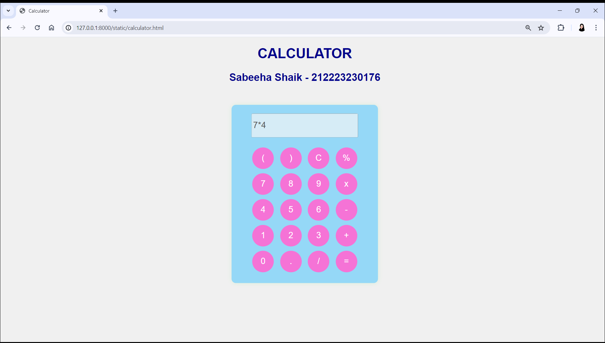

# Ex.08 Design of a Standard Calculator
## Date:01/05/2024

## AIM:
To design a web application for a standard calculator with minimum five operations.

## DESIGN STEPS:

### Step 1:
Clone the github repository and create Django admin interface.

### Step 2:
Change settings.py file to allow request from all hosts.

### Step 3:
Use CSS for creating attractive colors.

### Step 4:
Write JavaScript program for implementing five different operations.

### Step 5:
Validate the HTML and CSS code.

### Step 6:
Publish the website in the given URL.

## PROGRAM :
```
calculator.html

<!DOCTYPE html>
<html lang="en">
<head>
<meta charset="UTF-8">
<meta name="viewport" content="width=device-width, initial-scale=1.0">
<title>Calculator</title>
<link rel="stylesheet" type="text/css" href="style.css">
</head>
<body bgcolor="pink" text="darkblue">
    <h1 align="center">CALCULATOR</h1>
    
    <h2 class="text" align="center ">Sabeeha Shaik - 212223230176</h2>

<div class="calculator">
  
  <input type="text" id="result" disabled>
  <br><br>
  <button class="btn" onclick="appendOperation('(')">(</button>
  <button class="btn" onclick="appendOperation(')')">)</button>
  <button class="btn" onclick="clearResult()">C</button>
  <button class="btn" onclick="appendOperation('%')">%</button>
  <br>
  <button class="btn" onclick="appendNumber('7')">7</button>
  <button class="btn" onclick="appendNumber('8')">8</button>
  <button class="btn" onclick="appendNumber('9')">9</button>
  <button class="btn" onclick="appendOperation('*')">x</button>
  <br>
  <button class="btn" onclick="appendNumber('4')">4</button>
  <button class="btn" onclick="appendNumber('5')">5</button>
  <button class="btn" onclick="appendNumber('6')">6</button>
  <button class="btn" onclick="appendOperation('-')">-</button>
  <br>
  <button class="btn" onclick="appendNumber('1')">1</button>
  <button class="btn" onclick="appendNumber('2')">2</button>
  <button class="btn" onclick="appendNumber('3')">3</button>
  <button class="btn" onclick="appendOperation('+')">+</button>
  <br>
  <button class="btn" onclick="appendNumber('0')">0</button>
  <button class="btn" onclick="appendNumber('.')">.</button>
  <button class="btn" onclick="appendOperation('/')">/</button>
  <button class="btn" onclick="calculate()">=</button>
  
  
  
  
</div>

<script src="index.js"></script>

</body>
</html>
```

```
style.css

body {
    font-family: Arial, sans-serif;
    background-color: #f0f0f0;
  }
  
  .calculator {
    width: 300px;
    margin: 50px auto;
    background-color: #95d8f7;
    border-radius: 10px;
    box-shadow: 0 0 10px rgba(17, 230, 34, 0.1);
    padding: 20px;
    text-align: center;
  }
  
  .calculator img {
    width: 100px;
    height: 100px;
    margin-bottom: 20px;
  }
  
  #result {
    width: 80%; 
    height: 50px; 
    font-size: 20px; 
  }
  
  .btn {
    width: 50px;
    height: 50px;
    border: none;
    background-color: #f573d6;
    color: #fff;
    font-size: 20px;
    border-radius: 50%;
    margin: 5px;
    cursor: pointer;
  }
  
  .btn:hover {
    background-color: #f3ec6e;
  }
```

```
index.js

// Function to append a number to the input field
function appendNumber(num) {
    document.getElementById('result').value += num;
  }
  
  // Function to append an operation to the input field
  function appendOperation(op) {
    document.getElementById('result').value += op;
  }
  
  // Function to clear the input field
  function clearResult() {
    document.getElementById('result').value = '';
  }
  
  // Function to calculate the result
  function calculate() {
    try {
      // Replace '%' with '/100' for calculation, because eval doesn't interpret '%' as a division by 100
      var expression = document.getElementById('result').value.replace(/%/g, '/100');
      document.getElementById('result').value = eval(expression);
    } catch(err) {
      document.getElementById('result').value = 'Error';
    }
  }

```

## OUTPUT:




## RESULT:
The program for designing a standard calculator using HTML and CSS is executed successfully.
